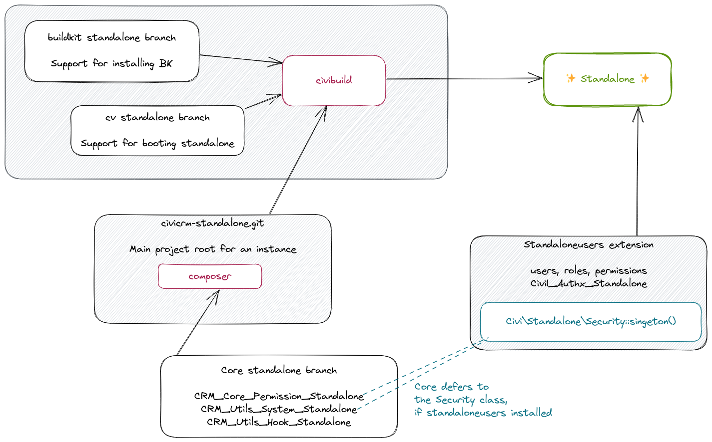

# CiviCRM (Standalone)

This is the development repository for [CiviCRM Standalone](https://lab.civicrm.org/dev/core/-/wikis/standalone). It aims to provide a version of [CiviCRM](https://civicrm.org) that does not require a content management system (CMS), such as WordPress or Drupal.

It is still in the early development stages. Eventually we aim to provide a zip/tar archive that can be uploaded to a web server. Currently it requires [composer](https://getcomposer.org/) or [buildkit](), which are fairly technical tools used mostly by (respectively) PHP and CiviCRM developers.

## Development

We are using CiviCRM's Gitlab for issues/discussion, and Github pull-requests for tracking code changes.

* CiviCRM Standalone meta-issue: https://lab.civicrm.org/dev/core/-/issues/2998
* CiviCRM Standalone github repo: https://github.com/civicrm/civicrm-standalone

We also have a [CiviCRM Standalone channel](https://chat.civicrm.org/civicrm/channels/standalone) on CiviCRM's chat.

There are four key repositories:

1. [Buildkit](https://github.com/civicrm/civicrm-buildkit/) *The standalone work is now included in the main branch.*
2. [cv](https://github.com/civicrm/cv) *The standalone work is now included in the main branch.*
3. [This repo (civicrm-standalone)](https://github.com/civicrm/civicrm-standalone)
4. Temporarily: **@artfulrobot fork of** [CiviCRM Core](https://github.com/artfulrobot/civicrm-core/tree/artfulrobot-standalone-core-1)
5. <del>[Standalone Users](https://lab.civicrm.org/extensions/standaloneusers/) extension.</del> This is now moved to being a core extension.



In words:

- Buildkit provides the `civibuild` command for creating local instances of 
  CiviCRM. It includes instructions for fetching this repo.

- Those instances include the `cv` command/tool, and have this repo as the project's 
  webroot.

- The composer.json file in this repo pulls in the @artfulrobot fork/branch of CiviCRM core.

- The standalone users core extension is then installed on the instance using 
  the command line (it will be hidden from the extensions UI), to provide the access restrictions.

## Project layout

This repo as top dir of project:

- `data/` holds non-web-accessible files including ConfigAndLog, Smarty 
 templates and settings files.
- `web/` holds web-accessible files:
  - `index.php` This is the main router/request handler.
  - `upload/` holds all the other gubbins, including the `ext/` dir for 
     extensions.
- `vendor/civicrm/` holds all the composer-sourced code, notably including:
  - `civicrm-core` The core files


## Install with buildkit

```
civibuild create mytest1 --type standalone-clean
```

Note that this will always install the latest master/main branch (technically, the artfulrobot fork of master)

You should now be able to see CiviCRM up and running. Jump to Next Steps.

## Install with composer

If you don't want the buildkit environment and you want to test the web-based installer, you can do it this way. It assumes you have setup your own httpd/php/sql services and configured them.

Clone this repo as the root of your project and pull in dependencies:

```
cd /var/www/
git clone git@github.com:civicrm/civicrm-standalone.git standalone
cd standalone
composer install
```

Unless your php worker runs as your own user, you may need to configure permissions (adjust for your set-up). e.g.

```
PHPWORKERUSER=www-data
mkdir -m2770 -p web/upload data
chmod g+rwX -R web/upload data
chgrp $PHPWORKERUSER web/upload data
```

Now we need to create some SQL and the database:

```
# The brackets here save you a cd - command after!
( cd vendor/civicrm/civicrm-core/xml && php GenCode.php 0 0 Standalone; )

# create the database - you may need to add your credentials if not stored in ~/.my.cnf
mysql -e "CREATE DATABASE standalone_civicrm;"
```

Now visit the site in your browser. You should get the installer page, but with lots of red notices about database stuff. That's ok, it's just because it doesn't know the DSN for the database. Edit the DSN yourself at the bottom of the page and hit Apply.

At the end you should be able to access /civicrm

## Next steps

1. Enable and configure the authx extension from **Administer » System Settings » Authentication**. You'll need to add *User Password* to the **Acceptable credentials (HTTP Session Login) select. And hit **Save**.

2. Install the standaloneusers extension by `cv en standaloneusers` (it is a core extension, so will already be part of your docroot)

3. Read the standaloneusers/README.md

## About CiviCRM

CiviCRM is web-based, open source, Constituent Relationship Management (CRM) software geared toward meeting the needs of non-profit and other civic-sector organizations.

As a non profit committed to the public good itself, CiviCRM understands that forging and growing strong relationships with constituents is about more than collecting and tracking constituent data - it is about sustaining relationships with supporters over time.

To this end, CiviCRM has created a robust web-based, open source, highly customizable, CRM to meet organizations’ highest expectations right out-of-the box. Each new release of this open source software reflects the very real needs of its users as enhancements are continually given back to the community.

With CiviCRM's robust feature set, organizations can further their mission through contact management, fundraising, event management, member management, mass e-mail marketing, peer-to-peer campaigns, case management, and much more.

CiviCRM is localized in over 20 languages including: Chinese (Taiwan, China), Dutch, English (Australia, Canada, U.S., UK), French (France, Canada), German, Italian, Japanese, Russian, and Swedish.

For more information, visit the [CiviCRM website](https://civicrm.org).
